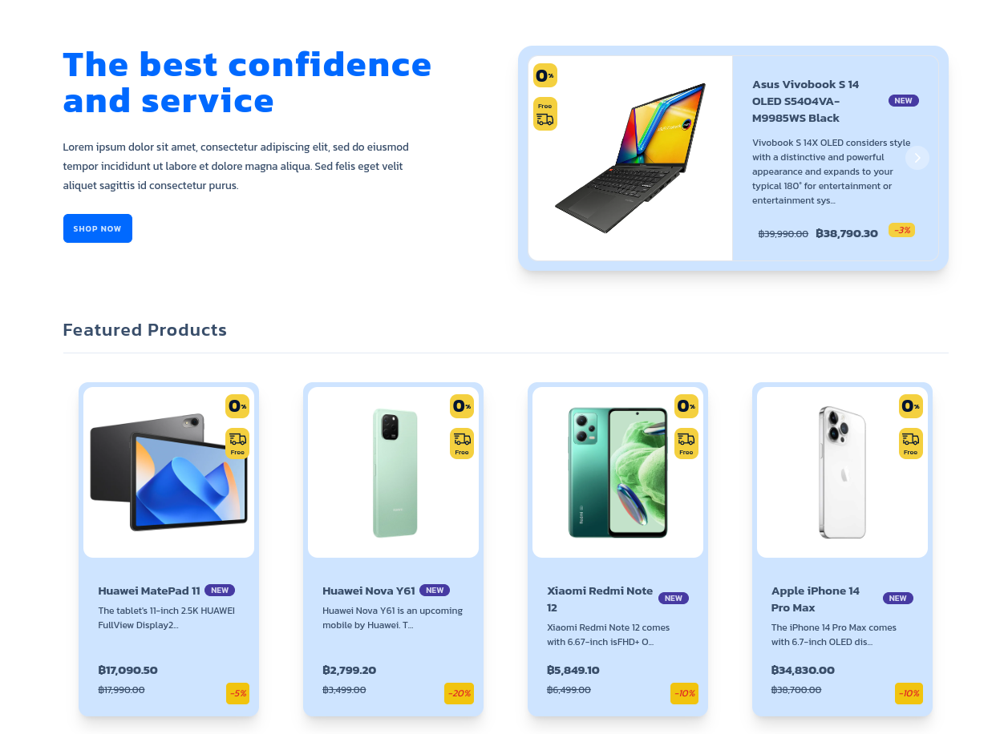

&nbsp;&nbsp;&nbsp;&nbsp;&nbsp;&nbsp;

  <h1 align="center">techHub store</h1>

<h4 style="text-align: center; font-size: 30px; text-decoration: underline"> 
    <a href="https://tecth-hub.netlify.app/">Demo</a>
</h4>

## Introduction

Welcome to TechHub Store - your one-stop destination for all things tech! This repository hosts the source code for an online store where you can explore and purchase the latest gadgets, electronics, and tech accessories.

### Features

- **User-friendly Interface:** Navigate through our store with ease and find the products you love.
- **Product Categories:** Explore a wide range of categories, from smartphones to computers devices.
- **Secure Checkout:** Enjoy a secure and hassle-free checkout process for your purchases.
- **Responsive Design:** Access the store seamlessly on various devices - desktops, tablets, and smartphones.

### Technologies Used

- **TypeScript**: A superset of JavaScript that adds static typing and other features.
- **JavaScript**: A high-level, interpreted, object-oriented scripting language.
- **Node.js**: A JavaScript runtime for server-side development.
- **React**: A JavaScript library for building user interfaces.
- **React Router**: A library for routing in React.
- **Redux Toolkit**: A state management library for React. It simplifies the process of state management and allows us to manage complex state in our applications.
- **Redux-Saga**: A library for asynchronous actions in Redux.
- **Tailwind**: A utility-first CSS framework for rapidly building custom user interfaces.
- **Stripe**: A payment gateway for online transactions.
- **Auth0**: A user authentication and authorization service.
- **Airtable**: A cloud-based database for storing and retrieving data.
- **Netlify**: A cloud hosting platform.
- **Vite**: A build tool for modern web development.
- **Flowbite**: A library for building responsive and accessible web components.
- **DaisyUI**: A UI library for Tailwind CSS.

### Create a bug report

If you see an error message or run into an issue, please [create bug report](https://github.com/Nasaee/techhub-store/issues/new).

### Submit a feature request

If you have an idea, or you're missing a capability that would make development easier and more robust, please [Submit feature request](https://github.com/Nasaee/techhub-store/issues/new).

If a similar feature request already exists, don't forget to leave a "+1".
If you add some more information such as your thoughts and vision about the feature, your comments will be embraced warmly :)

## Contributing

We welcome contributions from the community! If you find any issues or have suggestions for improvements, feel free to open an [issue](https://github.com/Nasaee/techhub-store/issues) or submit a [pull request](https://github.com/Nasaee/techhub-store/pulls).

## Contributing

We welcome contributions from the community! If you find any issues or have suggestions for improvements, feel free to open an [issue](https://github.com/Nasaee/techhub-store/issues) or submit a [pull request](https://github.com/Nasaee/techhub-store/pulls).
